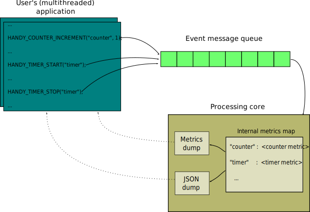

.. _architecture:

Architecture
============

Handystats library consists of the following components:

- metrics
- measuring points
- event message queue
- processing core
- metrics and JSON dumps

Here is an example of relation between user's application and handystats library:

Metrics
-------

**Metrics** is the base of handystats library statistics.

You're able to use metrics objects locally in your application,
but our main and preferable way of handling metrics is via measuring points.

See Metrics documentation for more details.

Measuring Points
----------------

**Measuring points** are the way to handle metrics resided inside handystats library core by passing event messages to them.

Examples of measuring points are:

.. code-block:: cpp

    HANDY_TIMER_START("timer");

    HANDY_COUNTER_INCREMENT("counter", 1);

See Measuring Points documentation for more details.

Event Message Queue
------------------------------

**Events** describe actions that should be taken on metrics stored inside handystats library core.
Such events are passed to the handystats library core by measuring points, which form certain events and push them into event message queue.

**Event message queue** is one-way communication channel between user's application and handystats library core.
User's application with use of measuring points publishes event messages to the queue and handystats library core processes them.

Since there's single message queue it's prone to become system's bottleneck especially in multithreaded environment.
To solve this problem we've designed this part of handystats library *lock-free*.

Processing Core
---------------

**Handystats library core** is the place where *hidden from user* work is done.
Here separate processing thread receives event messages from the event message queue and appropriately updates internal metrics.

At a time it updates *metics* and *json dumps* of internal metrics state which can be accessed immediately.

Metrics And JSON Dumps
----------------------

**Metrics** and **JSON dumps** are representation of internal metrics snap (which we call *dump*) in different formats.

**Metrics dump** is dump in object format (:code:`std::map`) which can be easily used by user's application in runtime.

**JSON dump** is dump in JSON text representation which can be printed or sended further.
